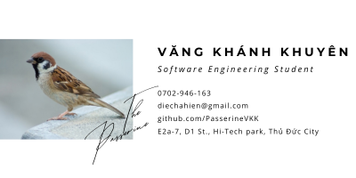

### Hi, I'm Passerine (Vang Khanh Khuyen)

I'm a **Software Engineering student at FPT University**, currently pursuing my path toward becoming a **Business Analyst**.

My journey lies at the intersection of Business Analysis, Software Engineering, and Artificial Intelligence. While I'm building a strong software engineering foundation through my university studies, I'm also focusing on developing the skills needed to understand problems, elicit requirements, analyze processes, and turn ideas into meaningful software solutions.

I'm particularly interested in **researching how AI can support the software development lifecycle**, especially **Requirements Engineering**. I'm curious about what AI can actually contribute to the way we elicit, analyze, specify, validate, and manage requirements, and where human judgment is still essential.

What I enjoy most is **looking at problems from a requirements perspective**. I like taking situations from everyday life, breaking them down into problems and requirements, processing the information, and connecting the pieces to tell the story behind a solution.

I enjoy **finding problems, understanding why they happen, and figuring out how they can be solved**.

---

## Currently focusing on

* **Business Analysis & Requirements Engineering**
* **AI for Software Engineering & Requirements Engineering**
* **Software Engineering fundamentals**
* **Database & System Analysis**
* **Research and evidence-based problem solving**

---

> *"I like turning problems into requirements, and requirements into solutions."*

